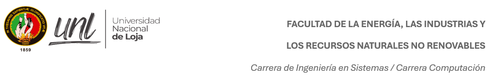

# UNIVERSIDAD NACIONAL DE LOJA
## FACULTAD DE LA ENERGÍA, LAS INDUSTRIAS Y LOS RECURSOS NATURALES NO RENOVABLES

 **Carrera Computación**  

**Teoría de la programación**

**Primer ciclo**

Septiembre 2025 - febrero 2026

**Docente:** PhD. Lissette López

**Estudiante:** Alison Tapia
