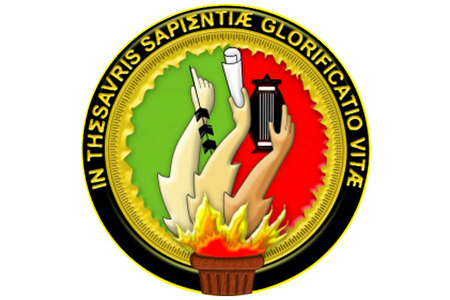

# UNIVERSIDAD NACIONAL DE LOJA
## FACULTAD DE LA ENERGÍA, LAS INDUSTRIAS Y LOS RECURSOS NATURALES NO RENOVABLES

### Carrera Computación
 
 

 

### Teoría de la programación

**Primer ciclo**

Septiembre 2025 - febrero 2026

**Docente:** PhD. Lissette López

**Estudiante:** Alison Tapia
