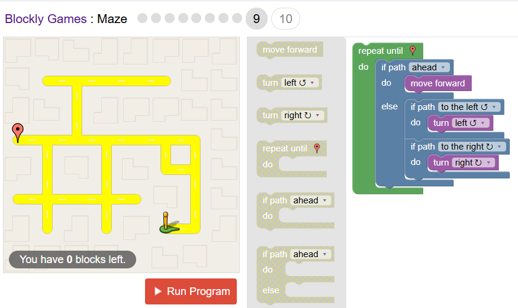

# Programación por bloques 
La programación en bloques es una forma de programación gráfica que permite crear algoritmos sencillos e instrucciones
mediante bloques que se conectan como piezas de un rompecabezas. Este tipo de programación facilita la comprensión de 
los fundamentos lógicos de la programación, ya que permite visualizar de manera clara el flujo de las instrucciones y los
diferentes pasos del algoritmo.  
“La programación visual o gráfica se desarrolló con el propósito de facilitar que los usuarios sin experiencia puedan 
comprender y crear programas con poca capacitación” [4]. Se realizaron ejercicios de programación en bloques mediante las 
páginas Blockly Games y PilasBloques, la cual presenta juegos interactivos organizados por niveles, en los que se construyó
algoritmos para cumplir las misiones o realizar las tareas correspondientes en cada nivel.

A continuación, se muestra uno de los niveles realizados:  

